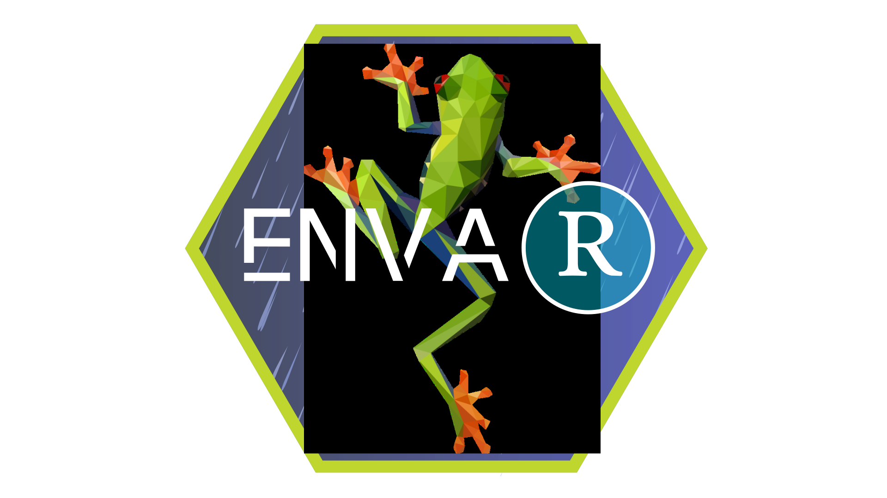

<div align="center">

<br><br>
<strong>Download and Process Environmental Variables for Species Distribution Modeling</strong>
</div>

[](https://github.com/yourusername/envar/actions/workflows/R-CMD-check.yaml)
[](https://CRAN.R-project.org/package=envar)
[](https://www.gnu.org/licenses/gpl-3.0)
[](https://doi.org/10.5281/zenodo.XXXXXXX)

---

**Navigation:** [Installazione](#installazione) • [Guida Rapida](#guida-rapida) • [Fonti dei Dati](#fonti-dei-dati) • [Utilizzo Dettagliato](#utilizzo-dettagliato) • [Citazione](#citazione)

---

## Indice dei Contenuti

- [Panoramica](#panoramica)
- [Installazione](#installazione)
- [Guida Rapida](#guida-rapida)
- [Fonti dei Dati](#fonti-dei-dati)
  - [Dati Climatici](#dati-climatici)
  - [Copertura del Suolo](#copertura-del-suolo)
  - [Topografia e Terreno](#topografia-e-terreno)
  - [Proprietà del Suolo](#proprietà-del-suolo)
  - [Indici di Vegetazione](#indici-di-vegetazione)
  - [Variabili Idrologiche](#variabili-idrologiche)
- [Utilizzo Dettagliato](#utilizzo-dettagliato)
- [Funzionalità Avanzate](#funzionalità-avanzate)
- [Consigli sulle Prestazioni](#consigli-sulle-prestazioni)
- [Contribuire](#contribuire)
- [Citazione](#citazione)
- [Licenza](#licenza)

## Panoramica

**envar** è un pacchetto R completo, progettato per semplificare l'acquisizione e l'elaborazione di variabili ambientali per la Modellazione della Distribuzione delle Specie (SDM) e la ricerca ecologica. Fornisce un'interfaccia unificata per accedere a molteplici set di dati ambientali globali, gestendo automaticamente il download, il ritaglio, il ricampionamento e la standardizzazione.

### Funzionalità Chiave

- **Interfaccia Unificata**: Un'unica funzione per accedere a oltre 15 fonti di dati ambientali
- **Copertura Globale**: Accesso a dati ambientali mondiali a diverse risoluzioni
- **Elaborazione Automatica**: Ritaglio, ricampionamento e mascheratura intelligenti sulla tua area di studio
- **Pronto per SDM**: Formato di output ottimizzato per i flussi di lavoro di modellazione della distribuzione delle specie
- **Caching Intelligente**: Evita download ridondanti con una gestione intelligente dei file
- **Flessibile**: Supporto per molteplici formati spaziali (sf, terra, coordinate)
- **Integrazione Multi-sorgente**: Combina variabili da diverse fonti senza soluzione di continuità

## Installation

### From CRAN 
```r
install.packages("envar")
```

### Development version from GitHub (recommended)

```r
# install.packages("remotes")
remotes::install_github("Andreacerofolini/envar")

#alternatively
# install.packages("devtools")
# devtools::install_github("Andreacerofolini/envar")

```

## Guida Rapida

```r
library(envar)

# Scarica le variabili bioclimatiche per l'Italia
bio_italy <- var_get(
  extent = "Italy",
  source = "worldclim",
  variables = "bioclim"
)

# Visualizza il risultato
plot(bio_italy)

# Scarica più layer ambientali
env_data <- var_get(
  extent = "Italy",
  source = c("worldclim", "cloud_topo", "ndvi"),
  variables = list(
    worldclim = "bioclim",
    cloud_topo = c("cloud", "elevation"),
    ndvi = "ndvi_mean"
  )
)
```

## Fonti dei Dati

### Dati Climatici

#### WorldClim 2.1
Variabili climatiche e bioclimatiche globali con risoluzione da 30 secondi a 10 minuti d'arco.

| Variabile | Descrizione | Unità |
|-----------|-------------|-------|
| `bioclim` | 19 variabili bioclimatiche (bio1-bio19) | Varie |
| `tmean` | Temperatura media mensile | °C |
| `tmin` | Temperatura minima mensile | °C |
| `tmax` | Temperatura massima mensile | °C |
| `prec` | Precipitazioni mensili | mm |
| `srad` | Radiazione solare | kJ m⁻² giorno⁻¹ |
| `wind` | Velocità del vento | m s⁻¹ |
| `vapr` | Pressione del vapore acqueo | kPa |

#### CHELSA v2.1
Dati climatici ad alta risoluzione con una migliore rappresentazione degli effetti orografici.

### Copertura del Suolo

#### ESA Land Cover CCI
Mappe annuali di copertura del suolo a 300m di risoluzione dal 1992-2020.

### Topografia e Terreno

#### Cloud Cover and Topography
Frequenza della copertura nuvolosa e variabili del terreno da EarthEnv.

### Proprietà del Suolo

Il pacchetto include l'accesso a dati su proprietà del suolo (HWSD).

### Indici di Vegetazione

Accesso a indici di vegetazione (NDVI) per il monitoraggio della copertura vegetale.

### Variabili Idrologiche

Dati idrologici (HydroSHEDS), aridità, vento e stabilità climatica.

## Utilizzo Dettagliato

### Specificare l'Estensione Spaziale

envar accetta molteplici formati per definire la tua area di interesse:

```r
# 1. Nome di un paese o continente
data <- var_get(extent = "France", ...)

# 2. Oggetto SF (es. da uno shapefile)
shp <- sf::st_read("study_area.shp")
data <- var_get(extent = shp, ...)

# 3. Matrice di coordinate per l'estrazione di punti
coords <- matrix(c(10.5, 45.8, 11.2, 46.1), ncol = 2, byrow = TRUE)
data <- var_get(extent = coords, ...)

# 4. Oggetto extent di Terra
ext <- terra::ext(c(xmin = 5, xmax = 15, ymin = 45, ymax = 50))
data <- var_get(extent = ext, ...)
```

### Salvare i risultati

Salva facilmente i tuoi dati in un file:

```r
# File singolo
data <- var_get(
  extent = "Portugal",
  source = "worldclim",
  variables = "bioclim",
  output_file = "portugal_bioclim.tif"
)
```

## Funzionalità Avanzate

### Esplorare le Opzioni Disponibili

```r
# Mostra tutte le fonti di dati disponibili
var_explore()

# Controlla le variabili per una fonte specifica
var_explore(source = "chelsa", what = "variables")

# Controlla le risoluzioni disponibili
var_explore(what = "resolutions")
```

## Consigli sulle Prestazioni

- Utilizza la cache intelligente per evitare download ridondanti
- Specifica solo le variabili necessarie per ridurre i tempi di elaborazione
- Per aree di studio grandi, considera l'uso di risoluzioni più basse

## Contribuire

I contributi sono benvenuti! Per favore, consulta le nostre [Linee Guida per i Contributi](CONTRIBUTING.md) per maggiori dettagli.

## Citazione

Se usi envar nella tua ricerca, per favore cita:

```bibtex
@software{envar,
  author = {Your Name},
  title = {envar: Download and Process Environmental Variables for SDM},
  year = {2024},
  url = {https://github.com/yourusername/envar},
  version = {0.1.0}
}
```

Quando si utilizzano fonti di dati specifiche, si prega di citare anche i fornitori originali come WorldClim 2.1, CHELSA, etc.

## Licenza

Questo pacchetto è rilasciato sotto licenza GPL-3. Vedi il file [LICENSE](LICENSE) per i dettagli.

---

**envar** - Rendere i dati ambientali accessibili per la ricerca ecologica.

[Segnala un Bug](https://github.com/yourusername/envar/issues) • [Richiedi una Funzionalità](https://github.com/yourusername/envar/issues) • [Documentazione](https://yourusername.github.io/envar/)
