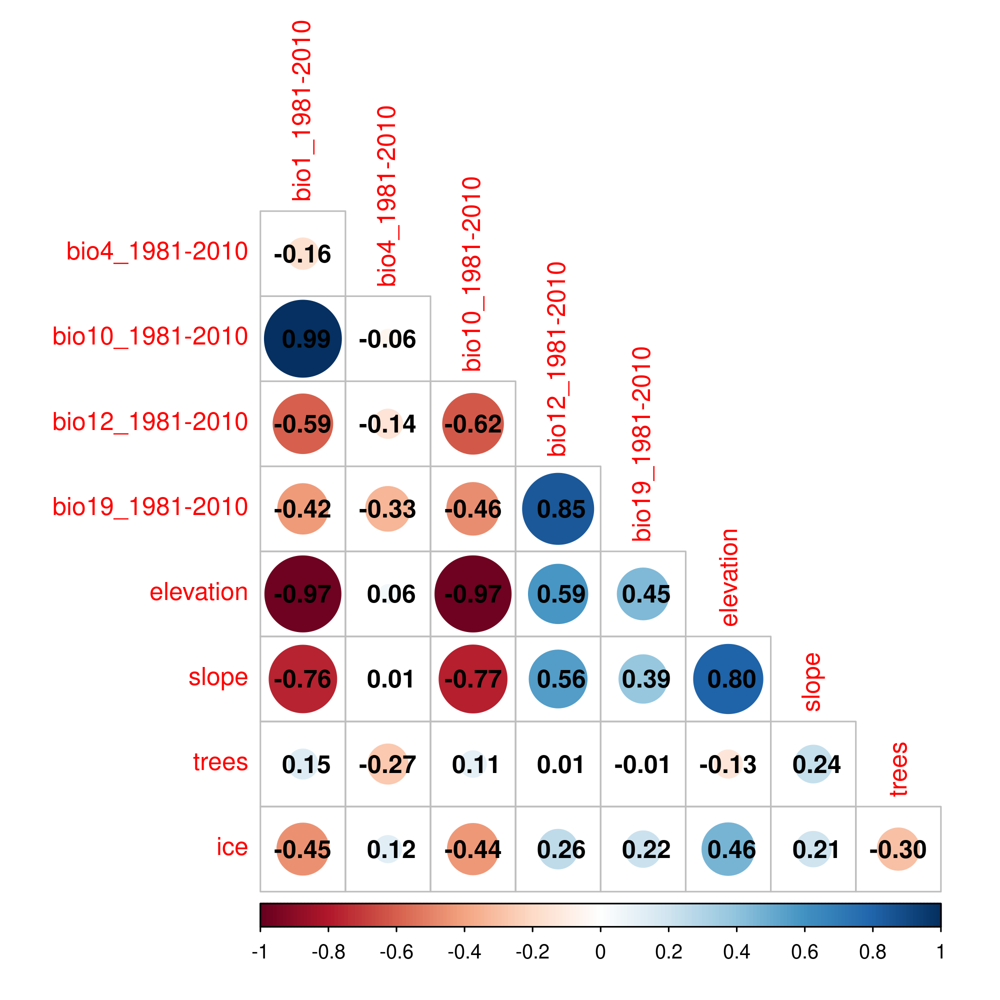

# Package overview

### A runnable mini-example

The download chunks in this article need network access, so they are
**shown but not executed** when the article is built. Every one of them
returns the same kind of object: a `SpatRaster` of stacked environmental
layers over a study area. So that the processing steps stay reproducible
and automatically tested, *envar* bundles one such stack — a small
**real** WorldClim (Fick & Hijmans 2017) extract for Switzerland
(`bio1`, `bio12`, `elevation`, `slope` at ~9 km). The chunk below loads
it **in place of a download** and demonstrates the study-area operations
covered in this overview: aggregating the grid, reprojecting to another
CRS, and checking collinearity.

``` r

library(envar)

# This stack stands in for the output of a download pipeline such as
#   par_set(country = "Switzerland", crs = 3035, res = 2) %>%
#     worldclim(vars = c("bio1", "bio12")) %>% topography(vars = "elevation")
switzerland <- terra::rast(
  system.file("extdata", "switzerland.tif", package = "envar")
)
switzerland
```

    ## class       : SpatRaster
    ## size        : 24, 55, 4  (nrow, ncol, nlyr)
    ## resolution  : 0.08333333, 0.08333333  (x, y)
    ## extent      : 5.916667, 10.5, 45.83333, 47.83333  (xmin, xmax, ymin, ymax)
    ## coord. ref. : lon/lat WGS 84 (EPSG:4326)
    ## source      : switzerland.tif
    ## names       :  bio1, bio12, elevation, slope
    ## min values  : -5.92,   307,       302,  0.05
    ## max values  : 11.05,  1994,      3337,  5.76

``` r

# Aggregate to a coarser grid, as par_set(res = ...) would do internally:
terra::aggregate(switzerland, fact = 2, fun = "mean")
```

    ## class       : SpatRaster
    ## size        : 12, 28, 4  (nrow, ncol, nlyr)
    ## resolution  : 0.1666667, 0.1666667  (x, y)
    ## extent      : 5.916667, 10.58333, 45.83333, 47.83333  (xmin, xmax, ymin, ymax)
    ## coord. ref. : lon/lat WGS 84 (EPSG:4326)
    ## source(s)   : memory
    ## names       :    bio1,  bio12, elevation,  slope
    ## min values  : -3.1025, 641.25,    340.25,  0.195
    ## max values  : 10.0575,   1861,   2873.75, 4.7075

``` r

# Reproject to a projected CRS in metres, as par_set(crs = 3035) would do internally:
terra::project(switzerland, "EPSG:3035")
```

    ## class       : SpatRaster
    ## size        : 33, 52, 4  (nrow, ncol, nlyr)
    ## resolution  : 6908.209, 6908.209  (x, y)
    ## extent      : 4003502, 4362729, 2527109, 2755080  (xmin, xmax, ymin, ymax)
    ## coord. ref. : ETRS89-extended / LAEA Europe (EPSG:3035)
    ## source(s)   : memory
    ## names       :      bio1,       bio12,   elevation,    slope
    ## min values  : -5.047194,  450.110199,  314.793427,  0.14869
    ## max values  :     10.99, 1915.514648, 3185.633301, 5.188708

``` r

# Check collinearity across the study area:
corr_check(switzerland)$summary
```

    ## [1] "High Cor (>0.7): bio1, elevation" "High VIF (>3): elevation, bio1"

The rest of this overview walks through how the study area and each
layer are obtained in the first place.

## 1. Introduction

*envar* is an *R* package that enables the download of a wide range of
environmental variables and their processing. In this tutorial we
explore all the potential uses of the package, to give an idea of the
breadth of uses and of the potential challenges and shortcuts. First we
illustrate the five ways in which it is possible to define a study
area: 1) global data, 2) a country or continent is specified, 3) an
ecological boundary is specified, 4) a polygon shapefile is loaded, 5) a
point shapefile is loaded, 6) a point data.frame is loaded, 7) a buffer
is specified in addition to another element, or 8) a species range is
created. Then, we illustrate how to project to a different reference
system, aggregate the results to a different resolution, how to check
for correlation and extrapolation, how to set NAs consistently across
raster layers, and how to optionally save the results locally.

## 2. Load the package

First we load *envar*. When executing this command, another package
(`dplyr`) will be automatically loaded to ensure the full functionality
of the package. However, other packages are often required for plotting
and further analyses and we also load them here for later use.

``` r

require(envar)
require(terra)
require(sf)
```

## 3. Set study area

Below, we illustrate a set of R commands that can be used to download
variables over a specified study area. The customization of the study
area occurs through the modification of arguments of the
[`par_set()`](https://animalbiodiversitylab.github.io/envar/reference/par_set.md)
function.

### 3.1. Global data

#### 3.1.1. Single layer

We here show an example of download of a single variable from a single
source, in this case the 1 km land cover based on ESA (Lo Parrino *et
al.* 2025). The variable is downloaded and maintains its original
extent. If not aggregated, the original grid resolution of any source is
always 30 arcseconds (0.00833°, or ~ 1 km) at the equator.

``` r

processed_singlelayer_lc <- par_set() %>% 
  melc(vars=c("ice")) 
```

The print in the console is omitted in this tutorial to avoid output
overflow. When run locally, the print in the console displays the
citation(s) and doi(s) for the downloaded source(s) to make sure that
users cite the proper source(s) when redacting manuscripts or using data
for public presentations. Then, a progress bar is shown for each
variable that is being downloaded and success messages are issued when
each variable has been correctly processed. The output is a SpatRaster
object from the *terra* package, which can be plotted and further
processed.

``` r

plot(processed_singlelayer_lc)
```


plot of chunk unnamed-chunk-5

#### 3.1.2. Multiple layers with different extents

When multiple layers from different sources are downloaded together, the
output automatically crops all layers to the smallest shared extent. If
more than two sources are reported, the code updates step-by-step the
shared extent across all layers.

``` r

processed_bilayer_global <- par_set() %>%
  chelsa(vars = c("pr"), months = 12, year = 2015) %>%
  melc(vars = c("ice"))
```

``` r

plot(processed_bilayer_global)
```


plot of chunk unnamed-chunk-7

The same occurs if the order of downloaded variables is inverted:

``` r

processed_bilayer_global_1 <- par_set() %>%
  melc(vars = c("ice")) %>%
  chelsa(vars = c("pr"), months = 12, year = 2015)
```

``` r

plot(processed_bilayer_global_1)
```


plot of chunk unnamed-chunk-9

``` r

# define the extents of the first SpatRaster object and of the second to check if they are the same

ext1 <- round(ext(processed_bilayer_global), 1)
ext2 <-round(ext(processed_bilayer_global_1), 1)

# print the resulting extents 
print(ext1)
```

    ## SpatExtent : -180, 180, -60, 84 (xmin, xmax, ymin, ymax)

``` r

print(ext2)
```

    ## SpatExtent : -180, 180, -60, 84 (xmin, xmax, ymin, ymax)

### 3.2. Country/continent

#### 3.2.1. Country

A country can be specified by name (case‑insensitive). The output is
cropped/masked to that country.

``` r

processed_bilayer_country <- par_set(country = "Italy") %>%
  melc(vars = c("ice")) %>%
  chelsa(vars = c("pr"), months = 12, years = 2015)
```

``` r

plot(processed_bilayer_country)
```


plot of chunk unnamed-chunk-12

#### 3.2.2. Continent

``` r

processed_singlelayer_africa <- par_set(continent = "Africa", buffer = 10) %>%
  melc(vars = c("forest"))
```

``` r

plot(processed_singlelayer_africa)
```


plot of chunk unnamed-chunk-14

All countries and continents are retrieved with internal calls to the
*rnaturalearth R* package, which allows the download of shapefiles from
the Natural Earth dataset. However, the continent of Europe has a
complex shape if downloaded from Natural Earth, and the invalid
resulting geometry provides unrealistic outputs. Thus, if continent =
“Europe” is specified, a shapefile of geographic Europe is used
(including Russia only up to the Ural mountains and excluding overseas
territories), based on data from the Global Administrative Areas
**[GADM](https://gadm.org)**.

``` r

processed_singlelayer_europe <- par_set(continent = "Europe") %>%
  melc(vars = c("forest"))
```

``` r

plot(processed_singlelayer_europe)
```


plot of chunk unnamed-chunk-16

#### 3.2.3. Set the scale

When retrieving continents or countries from Natural Earth (i.e., any
time the “country” or “continent” argument is used except for Europe),
an additional argument (“scale”) can be specified. This represents the
scale at which the shapefiles are retrieved, and can assume three
values: small (1:100 million), medium (the default; 1:50 m), and large
(1:10 m). The boundaries will appear rough and imprecise with a small
scale and finer with a large scale. The default is “medium” to download
data at a resolution that is sufficiently detailed but lighter and
faster than high-resolution.

``` r

# download variables over a country shape at "small" scale
processed_bilayer_country_small <- par_set(country = "Italy", scale = "small") %>%
  melc(vars = c("ice")) %>%
  chelsa(vars = c("pr"), months = 12, years = 2015)
```

``` r

plot(processed_bilayer_country_small)
```


plot of chunk unnamed-chunk-18

``` r

# download variables over a country shape at "large" scale
processed_bilayer_country_large <- par_set(country = "Italy", scale = "large") %>%
  melc(vars = c("ice")) %>%
  chelsa(vars = c("pr"), months = 12, years = 2015)
```

``` r

plot(processed_bilayer_country_large)
```


plot of chunk unnamed-chunk-20

### 3.3. Ecological boundary

#### 3.3.1. Ecoregions

It is possible to specify an ecoregion/biome/realm based on the work of
Dinerstein and colleagues published on BioScience (Dinerstein *et al.*
2017). Insert the full name of the ecoregion/biome/realm; to check the
names visit the interactive
**[website](https://ecoregions.appspot.com/)**.

``` r

processed_ecoregion <- par_set(ecoregion = "Lower Gangetic Plains moist deciduous forests") %>%
  melc(vars = c("tree"))
```

``` r

plot(processed_ecoregion)
```


plot of chunk unnamed-chunk-22

``` r

processed_biome <- par_set(biome = "Tundra") %>%
  melc(vars = c("ice"))
```

``` r

plot(processed_biome)
```


plot of chunk unnamed-chunk-24

``` r

processed_realm <- par_set(realm = "Neotropic") %>%
  melc(vars = c("tree"))
```

``` r

plot(processed_realm)
```


plot of chunk unnamed-chunk-26

#### 3.3.2. Zoogeographic regions

It is possible to specify a zoogeographic region/realm based on the
update of Wallace’s zooregions by Holt and colleagues (Holt *et al.*
2013). Insert the full name of the zoogeographic region/realm.

The following zooregions are available: “South American”, “Australian”,
“Novozelandic”, “African”, “Madagascan”, “Papua-Melanesian”,
“Amazonian”, “Guineo-Congolian”, “Indo-Malayan”, “Panamanian”,
“Oriental”, “Saharo-Arabian”, “Mexican”, “Chinese”, “North American”,
“Eurasian”, “Tibetan”, “Japanese”, “Arctico-Siberian”, and “Polynesian”.

``` r

processed_zooregion <- par_set(zooregion = "Madagascan") %>%
  melc(vars = c("tree"))
```

``` r

plot(processed_zooregion)
```


plot of chunk unnamed-chunk-28

And the following zoorealms are available: “Neotropical”, “Australian”,
“Afrotropical”, “Madagascan”, “Oceanina”, “Oriental”, “Panamanian”,
“Saharo-Arabian”, “Nearctic”, “Sino-Japanese”, and “Palearctic”.

``` r

processed_zoorealm <- par_set(zoorealm = "Neotropical") %>%
  melc(vars = c("tree"))
```

``` r

plot(processed_zoorealm)
```


plot of chunk unnamed-chunk-30

#### 3.3.3. Mountain regions

The Global Mountain Biodiversity Assessment working group has defined a
classification of mountain systems (Snethlage *et al.* 2022). We make
available through the package the large scale selection of
non-overlapping mountain systems (291). To see the available mountain
regions and their names check the
**[website](https://www.earthenv.org/mountains)**.

``` r

processed_mountain_region <- par_set(mountain_region = "European Alps") %>%
  melc(vars = c("tree"))
```

``` r

plot(processed_mountain_region)
```


plot of chunk unnamed-chunk-32

#### 3.3.4. CMEC mountain regions

The Center for Macroecology, Evolution and Climate at the University of
Copenhagen has developed another classification of mountain regions
(Rahbek *et al.* 2019). We make available through the package the
mountain regions so defined (135). To see the available mountain regions
and their names check the original publication.

``` r

processed_mountain_region_cmec <- par_set(mountain_region_cmec = "Alps and central European outliers") %>%
  melc(vars = c("tree"))
```

``` r

plot(processed_mountain_region_cmec)
```


plot of chunk unnamed-chunk-34

#### 3.3.5. Glacier regions

The Randolph Glacier Inventory team defined a set of 19 (old version) or
20 (new version) glacier regions that are broad areas that encompass
different mountainous and polar areas of the globe (Pfeffer *et al.*
2014). Here, we make available both the 19 regions classification and
the 20 regions classification. The full name of the glacier region must
be inserted and must be one of the following:

(For the 19 glacier regions)

1.  Alaska  
2.  Western Canada and USA
3.  Arctic Canada, North  
4.  Arctic Canada, South
5.  Greenland Periphery  
6.  Iceland  
7.  Svalbard and Jan Mayen
8.  Scandinavia
9.  Russian Arctic  
10. Asia, North
11. Central Europe
12. Caucasus and Middle East
13. Asia, Central  
14. Asia, South West  
15. Asia, South East  
16. Low Latitudes  
17. Southern Andes
18. New Zealand  
19. Antarctic and Subantarctic

(For the 20 glacier regions)

1.  Alaska
2.  Western Canada and USA
3.  Arctic Canada North
4.  Arctic Canada South  
5.  Greenland Periphery  
6.  Iceland  
7.  Svalbard and Jan Mayen
8.  Scandinavia
9.  Russian Arctic
10. North Asia  
11. Central Europe  
12. Caucasus and Middle East  
13. Central Asia
14. South Asia West  
15. South Asia East
16. Low Latitudes  
17. Southern Andes
18. New Zealand
19. Subantarctic and Antarctic Islands
20. Antarctic Mainland

``` r

processed_glacier_region <- par_set(glacier_region_19 = "Central Europe") %>%
  melc(vars = c("ice"))
```

``` r

plot(processed_glacier_region)
```


plot of chunk unnamed-chunk-36

#### 3.3.6. Freshwater ecoregions

Freshwater ecoregions have been widely used in ecological studies
following their definition by (Abell *et al.* 2008). As the provided
shapefile does not include the full names of freshwater ecoregions but
only their numeric IDs, instead of the name the user must insert the
ecoregion ID. Check the interactive interface
**[here](https://www.feow.org/ecoregions/interactive-map)** to find out
the available freshwater ecoregions and their IDs. We consider the
Florida Peninsula (ID = 156) as an example here.

``` r

processed_freshwater_ecoregion <- par_set(freshwater_ecoregion = 156) %>%
  melc(vars = c("tree"))
```

``` r

plot(processed_freshwater_ecoregion)
```


plot of chunk unnamed-chunk-38

#### 3.3.7. Marine regions

Marine regions are available from two different data references; the
first one is the Marine Ecoregions Of the World (MEOW) (Spalding *et
al.* 2007), which provides a classification of coastal and shelf areas.
The second one is the Pelagic Provinces Of the World (PPOW) (Spalding
*et al.* 2012), providing an inventory of surface pelagic waters. The
available arguments are “marine_ecoregion”, “marine_realm”, and
“marine_province” for MEOW, and “pelagic_province”, “pelagic_biome”, and
“pelagic_realm” for PPOW. You can explore the MEOW available names
**[here](https://databasin.org/maps/new/#datasets=3b6b12e7bcca419990c9081c0af254a2)**
and the PPOW available names through the relative publication.

``` r

processed_marine_ecoregion <- par_set(marine_ecoregion = "East African Coral Coast", res = 6) %>%
  biooracle(vars = c("o2"))
```

``` r

plot(processed_marine_ecoregion)
```


plot of chunk unnamed-chunk-40

### 3.4. Custom shapefile

#### 3.4.1. Points

If a POINT shapefile is used and no buffer is applied, the output will
be a data.frame containing columns: ID (integer going from 1 to the
length of the dataset), X (longitude), Y (latitude), and the extracted
values over the specified points.

``` r

points <- sf::st_sample(Alps, size = 100, type = "random")

processed_singlelayer_points <- par_set(shape = points, crs=3035) %>%
  melc(vars = c("ice"))

processed_bilayer_points <- par_set(shape = points, crs=3035) %>%
  melc(vars = c("ice")) %>%
  chelsa(vars = c("pr"), months = 12, year = 2015)
```

``` r

# visualize the points shapefile
plot(Alps$geometry)
plot(points, add =T)
```


plot of chunk unnamed-chunk-42

``` r

# visualize the resulting data.frame with the extracted values when only one source was used
head(processed_singlelayer_points)
```

    ##   ID       X       Y ice
    ## 1  1 4087407 2393913   0
    ## 2  2 4673719 2517564   0
    ## 3  3 4702000 2673471   0
    ## 4  4 4074334 2309450   0
    ## 5  5 4255502 2642772   0
    ## 6  6 3962724 2486021   0

``` r

# visualize the resulting data.frame with the extracted values when two or more sources were used
head(processed_bilayer_points)
```

    ##   ID       X       Y ice pr_2015_12
    ## 1  1 4087407 2393913   0          2
    ## 2  2 4673719 2517564   0          1
    ## 3  3 4702000 2673471   0          2
    ## 4  4 4074334 2309450   0         13
    ## 5  5 4255502 2642772   0         21
    ## 6  6 3962724 2486021   0         18

#### 3.4.2. Polygon

The user can load a shapefile of type POLYGON and use it to crop/mask
the downloaded variables. Here we use the already included European Alps
shapefile
([`Alps()`](https://animalbiodiversitylab.github.io/envar/reference/Alps.md)).

``` r

processed_bilayer_shapefile <- par_set(shape = Alps) %>%
  melc(vars = c("ice")) %>%
  chelsa(vars = c("pr"), months = 12, year = 2015)
```

``` r

plot(processed_bilayer_shapefile[[2]])
```


plot of chunk unnamed-chunk-46

### 3.5. Data frame of points

Points can be fed into the package in the form of a data.frame with only
two columns that represent coordinates. Column names must be **X** and
**Y**, reporting the longitude and latitude, respectively. The CRS is
assigned based on user input (default: 4326).

``` r

points3035 <- st_transform(points, 3035)
points3035df <- as.data.frame(st_coordinates(points3035))

processed_singlelayer_pointsdf <- par_set(pointsdf = points3035df, crs = 3035) %>%
  melc(vars = c("ice"))

processed_bilayer_pointsdf <- par_set(pointsdf = points3035df, crs = 3035) %>%
  melc(vars = c("ice")) %>%
  chelsa(vars = c("pr"), months = 12, year = 2015)
```

``` r

# visualize the resulting data.frame when using only one source
head(processed_singlelayer_pointsdf)
```

    ##   ID       X       Y ice
    ## 1  1 4087407 2393913   0
    ## 2  2 4673719 2517564   0
    ## 3  3 4702000 2673471   0
    ## 4  4 4074334 2309450   0
    ## 5  5 4255502 2642772   0
    ## 6  6 3962724 2486021   0

``` r

# visualize the resulting data.frame when using multiple sources
head(processed_bilayer_pointsdf)
```

    ##   ID       X       Y ice pr_2015_12
    ## 1  1 4087407 2393913   0          2
    ## 2  2 4673719 2517564   0          1
    ## 3  3 4702000 2673471   0          2
    ## 4  4 4074334 2309450   0         13
    ## 5  5 4255502 2642772   0         21
    ## 6  6 3962724 2486021   0         18

### 3.6. Buffer

#### 3.6.1. Apply a buffer to a shape

A positive buffer expands the shape by the specified number of
kilometers; a negative buffer shrinks it. Units are always km for the
user. If the CRS is left to the default (crs=“EPSG:4326”), the function
used by the package (st_buffer) automatically transforms the kilometers
in degrees so that the buffer is circular on the 3D surface (and the
buffer might thus appear non-circular if plotted in 2D). However, it is
recommended to always specify a projected CRS when using buffers to
avoid potential distortions.

``` r

processed_singlelayer_buffer <- par_set(country = "Italy", crs = 3035, buffer = 10) %>%
  melc(vars = c("ice"))
```

``` r

plot(processed_singlelayer_buffer)
```


plot of chunk unnamed-chunk-51

Negative buffer example:

``` r

processed_singlelayer_negative_buffer <- par_set(country = "Italy", crs = 3035, buffer = -10) %>%
  melc(vars = c("ice"))
```

``` r

plot(processed_singlelayer_negative_buffer)
```


plot of chunk unnamed-chunk-53

A buffer at global scale (no shape or data.frame or country defined)
triggers an error (not shown here):

``` r

processed_singlelayer_global_buffer <- par_set(buffer = 10) %>%
  melc(vars = c("ice"))
```

#### 3.6.2. Apply a buffer when using points

A buffer (in km) expands the points to a polygon and all the variables
that are downloaded are subsequently cropped to that shape. This option
can be very useful for instance in Species Distribution Modelling,
whereby records of species presence are often known but not absences.
The so-called pseudo-absences (i.e. simulated absences of species) and
background points (points used to define the background environmental
conditions and compare them to presences, as done in the Maximum Entropy
algorithm) are typically picked in a defined radius around the
presences, to define areas that could theoretically be reached by the
species via dispersal. Additionally, picking pseudo-absence/background
points in a buffer around presences allows to better simulate the
spatial sampling effort patterns and replicate them.

``` r

processed_bilayer_points_buffer <- par_set(pointsdf = points3035df, crs = 3035, buffer = 50) %>%
  melc(vars = c("ice")) %>%
  chelsa(vars = c("pr"), months = 12, year = 2015)
```

``` r

plot(processed_bilayer_points_buffer)
```


plot of chunk unnamed-chunk-56

### 3.7. Further options

#### 3.7.1. Land mask

When downloading data, it is possible to apply a land mask to remove all
sea/ocean cells from the output. This can be done by setting the
argument “land” to TRUE (default to FALSE, i.e., no land mask is
applied). Here we use the glacier region centered on the European Alps
to display a region with both land and sea, to show that sea is masked
as NA when “land” is set to TRUE. As the land outlines are retrieved
from the Natural Earth database, it is possible to use the argument
“scale” as for countries/continents, to refine the precision of
coastline definition (check paragraph 3.2.3. “Set the scale” above).

Without land mask:

``` r

processed_nolandmask <- par_set(glacier_region_19 = "Central Europe") %>%
  earthenvlandcover(vars = c("ice")) 
```

``` r

plot(processed_nolandmask)
```


plot of chunk unnamed-chunk-58

With land mask:

``` r

processed_landmask <- par_set(glacier_region_19 = "Central Europe", land = TRUE) %>%
  earthenvlandcover(vars = c("ice")) 
```

``` r

plot(processed_landmask)
```


plot of chunk unnamed-chunk-60

#### 3.7.2. Species range

For many applications, it is important to quantify the surface where a
species is found as precisely as possible, for instance when estimating
the Area Of Occupancy (AOO) for IUCN assessments. Thus, it is possible
to use the alpha_hull = TRUE argument to define a polygon that surrounds
at least 99% of occurrence records of the species, defining the maximum
range extent (Daru 2025). This option works only if occurrence points
are specified as X and Y coordinates in the pointsdf argument. We use
the Apollo dataset as an example, a dataset of occurrences of the
*Parnassius apollo* butterfly; the dataset is already included in the
package.

``` r

processed_range <- par_set(pointsdf = Apollo, alpha_hull = TRUE) %>% 
  melc(vars=c("ice"))
```

``` r

plot(processed_range)
```


plot of chunk unnamed-chunk-62

It can also be used in conjunction with a buffer. In this case, an alpha
hulll will be created and then expanded by the specified buffer.

``` r

processed_range_buffer <- par_set(pointsdf = Apollo, alpha_hull = TRUE, buffer = 10) %>% 
  melc(vars=c("ice"))
```

``` r

plot(processed_range_buffer)
```


plot of chunk unnamed-chunk-64

## 4. Project to another reference system

The single layer is downloaded and maintains its original extent. But
additionally it is projected to the desired Coordinate Reference System
(CRS). The default CRS in *envar* is the Geographic Reference System
(GRS) WGS 84 (EPSG: 4326). This is the most commonly used GRS for global
analyses. GRS assume that the Earth is an ellipsoid (or spheroid) and
provide coordinates based on a 3D surface with degrees and
latitude-longitude values. However, these systems are not ideal to
compute distances as the meaning of degrees changes based on the
location on earth (e.g., 1 degree of longitude corresponds to ~ 111 km
at the equator but approaches zero towards the poles). Additionally,
users might want to improve spatial analysis accuracy, visualize data in
a specific projection, or align results with other data that use a
different CRS. Thus, a Projected Reference System (PRS) can be used,
where coordinates are based on the location on a 2D system. The
conversion from a GRS to a PRS always implies a certain amount of
distortion, and thus different PRS are optimized for different areas of
the globe to locally reduce distortion when moving from a 3D to a 2D
representation. Thus, users can use the argument “crs” in the
[`par_set()`](https://animalbiodiversitylab.github.io/envar/reference/par_set.md)
function to specify the desired CRS. Here we show an example of download
of a single variable from a single source, in this case the 1 km land
cover based on ESA (Lo Parrino *et al.* 2025), and its projection to the
local equal-area projection (EPSG:3035). Inside the crs argument, a
number or character representing the code of the PRS must be provided.
If nothing is specified, 4326 is assumed. The crs can also be specified
with the prefix ‘ESRI’ or ‘EPSG’ according to the system,
e.g. “EPSG:4326” or “ESRI:54009”.

``` r

processed_singlelayer_projected <- par_set(country = "Italy", crs=3035) %>% 
 melc(vars=c("ice"))
```

``` r

print(processed_singlelayer_projected)
```

    ## class       : SpatRaster 
    ## dimensions  : 1249, 1194, 1  (nrow, ncol, nlyr)
    ## resolution  : 982.9062, 982.9062  (x, y)
    ## extent      : 4004865, 5178455, 1484656, 2712306  (xmin, xmax, ymin, ymax)
    ## coord. ref. : ETRS89-extended / LAEA Europe (EPSG:3035) 
    ## source(s)   : memory
    ## name        :      ice 
    ## min value   :  0.00000 
    ## max value   : 99.62711

``` r

plot(processed_singlelayer_projected)
```


plot of chunk unnamed-chunk-66

## 5. Aggregate to a different resolution

A multiple of the native 30 arcsecond grid (~1 km at the equator) can be
set by using an aggregation factor, defined by the argument **res**. A
value of `res = 1` keeps the native resolution; any value \> 1
aggregates the raster by that factor. For instance, `res = 10`
aggregates the native grid to a resolution of ~10 km at the equator.
Aggregation is done by computing the mean value of all cells that are
part of the new larger cell.

``` r

processed_singlelayer_aggregated <- par_set(res = 100) %>%
  melc(vars = c("ice"))
```

``` r

print(processed_singlelayer_aggregated)
```

    ## class       : SpatRaster 
    ## dimensions  : 173, 432, 1  (nrow, ncol, nlyr)
    ## resolution  : 0.8333333, 0.8333333  (x, y)
    ## extent      : -180, 180, -60.16667, 84  (xmin, xmax, ymin, ymax)
    ## coord. ref. : lon/lat WGS 84 (EPSG:4326) 
    ## source(s)   : memory
    ## name        : ice 
    ## min value   :   0 
    ## max value   : 100

## 6. Correlation check

### 6.1. Add a correlation check when retrieving rasters

It is possible to call the
[`corr_check()`](https://animalbiodiversitylab.github.io/envar/reference/corr_check.md)
function at the bottom of the code to enable an automatic test of
correlation among the downloaded variables over the defined spatial area
and resolution. Doing this will produce a list containing the processed
SpatRaster, Pearson pairwise correlations, VIF statistics, and a saved
correlation plot.

``` r

processed_bilayer_corr_check <- par_set(shape = Alps, crs = 3035, res = 2, buffer = 10) %>% 
             chelsa(vars = c("bio1", "bio4", "bio10", "bio12", "bio19"),
                    years = "1981-2010") %>%
             topography(vars = c("elevation", "slope")) %>%
             melc(vars = c("trees", "ice")) %>%
             corr_check()
```

The output will thus be a list that contains the following elements:
“data” (the SpatRaster or data.frame with your downloaded data),
“correlation_matrix” containing a matrix of Pairwise Pearson’s
correlation coefficients between all variables, “vif” a data.frame
containing the Variance Inflation Factors for each variable, a “summary”
that reports if and which variables have a Pearson’s correlation
coefficient higher than \|0.6\| and/or a VIF higher than 3. Lastly, the
“plot_path” specifies the local directory to which a plot of the
Pearson’s pairwise correlation was saved.

``` r

# View the Pearson's pairwise correlation matrix
print(processed_bilayer_corr_check$correlation_matrix)
```

    ##                 bio1_1981-2010 bio4_1981-2010 bio10_1981-2010 bio12_1981-2010
    ## bio1_1981-2010       1.0000000    -0.17098433      0.99411075     -0.58856258
    ## bio4_1981-2010      -0.1709843     1.00000000     -0.06629979     -0.13822734
    ## bio10_1981-2010      0.9941107    -0.06629979      1.00000000     -0.61255277
    ## bio12_1981-2010     -0.5885626    -0.13822734     -0.61255277      1.00000000
    ## bio19_1981-2010     -0.4182732    -0.33185424     -0.45693075      0.84502782
    ## elevation           -0.9682340     0.06664318     -0.96993166      0.58178549
    ## slope               -0.7884759     0.01527641     -0.79705030      0.57544349
    ## trees                0.1420440    -0.28430061      0.10591260      0.02372563
    ## ice                 -0.4765922     0.13185174     -0.46273645      0.27137511
    ##                 bio19_1981-2010   elevation       slope        trees        ice
    ## bio1_1981-2010     -0.418273159 -0.96823403 -0.78847587  0.142043991 -0.4765922
    ## bio4_1981-2010     -0.331854239  0.06664318  0.01527641 -0.284300607  0.1318517
    ## bio10_1981-2010    -0.456930752 -0.96993166 -0.79705030  0.105912597 -0.4627365
    ## bio12_1981-2010     0.845027822  0.58178549  0.57544349  0.023725631  0.2713751
    ## bio19_1981-2010     1.000000000  0.44083530  0.39996749 -0.003624083  0.2299007
    ## elevation           0.440835298  1.00000000  0.83277881 -0.120815882  0.4857175
    ## slope               0.399967493  0.83277881  1.00000000  0.223848319  0.2433729
    ## trees              -0.003624083 -0.12081588  0.22384832  1.000000000 -0.3266344
    ## ice                 0.229900683  0.48571755  0.24337291 -0.326634442  1.0000000

``` r

# View the Variance Inflation Factor values
print(processed_bilayer_corr_check$vif)
```

    ##         Variables         VIF
    ## 1  bio1_1981-2010 2933.270334
    ## 3 bio10_1981-2010 2549.226924
    ## 6       elevation   37.362654
    ## 2  bio4_1981-2010   34.871455
    ## 7           slope    5.654897
    ## 4 bio12_1981-2010    5.320165
    ## 5 bio19_1981-2010    4.673379
    ## 8           trees    1.805555
    ## 9             ice    1.533835

To better understand the structure of correlation, we can also analyze
the correlation plot that was locally stored.



plot of chunk unnamed-chunk-72

### 6.2. Add a correlation check when using points

This will create a similar result as for the correlation test applied to
a SpatRaster object, but instead of a set of rasters, the first element
of the resulting list will be a data.frame with the extracted values.

``` r

processed_bilayer_points_corr_check <- par_set(shape = points) %>%
  melc(vars = c("ice")) %>%
  chelsa(vars = c("pr"), months = 12, year = 2015) %>%
  corr_check()
```

``` r

head(processed_bilayer_points_corr_check[[1]])
```

    ##   ID         X        Y ice pr_2015_12
    ## 1  1  7.061866 44.61497   0          2
    ## 2  2 14.523698 45.67426   0          1
    ## 3  3 15.015153 47.05874   0          2
    ## 4  4  6.938675 43.84918   0         13
    ## 5  5  9.141245 46.89501   0         21
    ## 6  6  5.428874 45.38758   0         18

## 7. Extrapolation check

It is possible to call the
[`extr_check()`](https://animalbiodiversitylab.github.io/envar/reference/extr_check.md)
function at the bottom of the code to enable an automatic test of
extrapolation, regardless of whether you requested already a
[`corr_check()`](https://animalbiodiversitylab.github.io/envar/reference/corr_check.md).
Ecological models often produce spurious predictions when predicting in
environmental conditions not present in the calibration range (Elith *et
al.* 2010). This problem can arise under two conditions: 1) at least a
variable has values outside the calibration range - strict extrapolation
-, or 2) all variables fall in the calibration range, but novel
combinations of predictor values are met - combinatorial extrapolation -
(Zurell *et al.* 2012). Inside the function it is possible to specify if
strict and/or combinatorial extrapolation has to be checked (argument
“type” - default to strict only), and it is necessary to specify the
calibration points as data.frame with X and Y columns (argument
“calib_points”) and the CRS of those coordinates (argument “calib_crs”)
if different from the default (EPSG:4326). Extrapolation is checked
creating an environmental overlap mask, using a method adapted from
Zurell et al. (2012) (Zurell *et al.* 2012) and implemented natively
within `envar`.

### 7.1. With rasters

The output is a list with a SpatRaster with one layer - two if both
strict and extrapolation are checked - reporting as 1 cells of
extrapolation and 0 cells of no extrapolation.

``` r

processed_bilayer_extr_check <- par_set(shape = Alps, crs = 3035) %>%
  melc(vars = c("ice")) %>%
  chelsa(vars = c("pr"), months = 12, year = 2015) %>%
  extr_check(calib_points = Apollo, calib_crs = 4326, type = c("strict", "combinatorial"))
```

``` r

plot(processed_bilayer_extr_check$extrapolation$strict)
```


plot of chunk unnamed-chunk-76

### 7.2. With points

If the output from the download pipeline is a data.frame (see
e.g. paragraphs 3.4.1 or 3.5), then, when using
[`extr_check()`](https://animalbiodiversitylab.github.io/envar/reference/extr_check.md),
one column is added to the data.frame - two if both strict and
extrapolation are checked -. This/these additional column(s) will report
extrapolation as 1 and no extrapolation as 0.

``` r

# for example, we use only the first 10 points of the Apollo dataset as a simulated data set to calibrate a model and then we want to apply it to a whole set of points covering a wider environmental range.
processed_points_extr_check <- par_set(pointsdf = Apollo) %>% 
  melc(vars = c("ice")) %>%
  chelsa(vars = c("pr"), months = 12, year = 2015) %>%
  extr_check(calib_points = Apollo[1:10,], calib_crs = 4326, type = c("strict", "combinatorial"))
```

``` r

head(processed_points_extr_check$extrapolation)
```

    ##   ID        X        Y  ice pr_2015_12 strict combinatorial
    ## 1  1 13.49513 47.10400 0.00          8      0             0
    ## 2  2 12.62265 47.03912 0.01         17      0             0
    ## 3  3  6.65878 44.16551 0.00         10      0             0
    ## 4  4  5.40699 44.15510 0.00          5      0             0
    ## 5  5  6.05580 44.58935 0.00          4      0             0
    ## 6  6  6.86447 44.42881 0.00          5      0             0

## 8. Set NAs

When the output from the download pipeline is a SpatRaster, it is
possible to specify that any cell that is NA in at least one layer is NA
in all layers. For instance, when downloading data from CHELSA (Karger
*et al.* 2017) and land cover from ESA (Lo Parrino *et al.* 2025), the
sea is not covered in the second source and it might thus be needless to
keep information on climate over the sea. We can thus set the “set_na”
argument to TRUE (default to FALSE, i.e., no NA mask is applied).

Without NA mask:

``` r

processed_bilayer_global <- par_set() %>%
  chelsa(vars = c("pr"), months = 12, year = 2015) %>%
  melc(vars = c("ice"))
```

``` r

plot(processed_bilayer_global)
```


plot of chunk unnamed-chunk-80

With NA mask:

``` r

processed_bilayer_global_namask <- par_set(set_na=TRUE) %>%
  chelsa(vars = c("pr"), months = 12, year = 2015) %>%
  melc(vars = c("ice"))
```

``` r

plot(processed_bilayer_global_namask)
```


plot of chunk unnamed-chunk-82

## 9. Save results

### 9.1. Save results as raster

If the “path” argument is used (default to NULL, i.e., no output stored
locally), the retrieved and processed variables will be stored locally.
Remember to specify the full path, including the filename and extension.

``` r

processed_stored_raster <- par_set(shape = Alps, crs = 3035, path = "../Out/storedraster.tif") %>%
  melc(vars = c("ice")) %>%
  chelsa(vars = c("pr"), months = 12, year = 2015)
```

### 9.2. Save results as table

The same can be done if the output is a data.frame. In this case, the
file written has to be a .csv file; specify the path accordingly.

``` r

processed_stored_table <- par_set(pointsdf = Apollo, path = "../Out/storedtable.csv") %>%
  melc(vars = c("ice")) %>%
  chelsa(vars = c("pr"), months = 12, year = 2015)
```

Results cannot be stored locally if the correlation or extrapolation
check is/are added, as the output will be a list and not a
SpatRaster/data.frame.

## 10. Conclusion

In this tutorial we have gone through all the potential ways in which
the user can tailor the download and processing of data. For simplicity
we have relied only on a few sources, but many more are available and
can be checked at the
**[reference](https://animalbiodiversitylab.github.io/envar/reference/)**
or at the detailed explanation of all **[sources and
variables](https://animalbiodiversitylab.github.io/envar/articles/variables)**.

## 11. References

Abell, R., Thieme, M.L., Revenga, C., Bryer, M., Kottelat, M.,
Bogutskaya, N., Coad, B., Mandrak, N., Balderas, S.C. & Bussing, W.
(2008). Freshwater ecoregions of the world: A new map of biogeographic
units for freshwater biodiversity conservation. *BioScience*, *58*,
403–414.

Daru, B.H. (2025). A global database of butterfly species native
distributions. *Ecology*, *106*, e4462.

Dinerstein, E., Olson, D., Joshi, A., Vynne, C., Burgess, N.D.,
Wikramanayake, E., Hahn, N., Palminteri, S., Hedao, P. & Noss, R.
(2017). An ecoregion-based approach to protecting half the terrestrial
realm. *BioScience*, *67*, 534–545.

Elith, J., Kearney, M. & Phillips, S. (2010). The art of modelling
range-shifting species. *Methods in Ecology and Evolution*, *1*,
330–342.

Fick, S.E. & Hijmans, R.J. (2017). WorldClim 2: New 1-km spatial
resolution climate surfaces for global land areas. *International
Journal of Climatology*, *37*, 4302–4315.

Holt, B.G., Lessard, J.P., Borregaard, M.K., Fritz, S.A., Araújo, M.B.,
Dimitrov, D., Fabre, P.H., Graham, C.H., Graves, G.R. & Jønsson, K.A.
(2013). An update of wallace’s zoogeographic regions of the world.
*Science*, *339*, 74–78.

Karger, D.N., Conrad, O., Böhner, J., Kawohl, T., Kreft, H., Soria-Auza,
R.W., Zimmermann, N.E., Linder, H.P. & Kessler, M. (2017). Climatologies
at high resolution for the earth’s land surface areas. *Scientific
Data*, *4*, 170122.

Lo Parrino, E., Simoncini, A., Ficetola, G.F. & Falaschi, M. (2025).
[Global 1-km land cover for ecological modelling from very high
resolution imagery](https://doi.org/10.32942/X2QM0B). *EcoEvoRxiv*, in
press.

Pfeffer, W.T., Arendt, A.A., Bliss, A., Bolch, T., Cogley, J.G.,
Gardner, A.S., Hagen, J.O., Hock, R., Kaser, G. & Kienholz, C. (2014).
The randolph glacier inventory: A globally complete inventory of
glaciers. *Journal of Glaciology*, *60*, 537–552.

Rahbek, C., Borregaard, M.K., Colwell, R.K., Dalsgaard, B.O., Holt,
B.G., Morueta-Holme, N., Nogues-Bravo, D., Whittaker, R.J. & Fjeldså, J.
(2019). Humboldt’s enigma: What causes global patterns of mountain
biodiversity? *Science*, *365*, 1108–1113.

Snethlage, M., Geschke, J., Spehn, E., Ranipeta, A., Yoccoz, N., Körner,
C., Jetz, W., Fischer, M. & Urbach, D. (2022). GMBA mountain inventory
v2.

Spalding, M.D., Agostini, V.N., Rice, J. & Grant, S.M. (2012). Pelagic
provinces of the world: A biogeographic classification of the world’s
surface pelagic waters. *Ocean & Coastal Management*, *60*, 19–30.

Spalding, M.D., Fox, H.E., Allen, G.R., Davidson, N., Ferdaña, Z.A.,
Finlayson, M., Halpern, B.S., Jorge, M.A., Lombana, A. & Lourie, S.A.
(2007). Marine ecoregions of the world: A bioregionalization of coastal
and shelf areas. *BioScience*, *57*, 573–583.

Zurell, D., Elith, J. & Schröder, B. (2012). Predicting to new
environments: Tools for visualizing model behaviour and impacts on
mapped distributions. *Diversity and Distributions*, *18*, 628–634.
