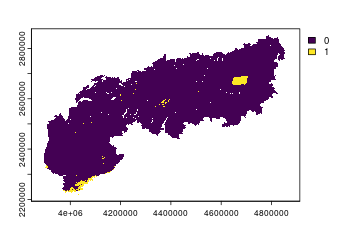

# Species distribution modelling

## Introduction

In this tutorial we show how *envar* can be used to streamline a species
distribution modelling framework, using as example the butterfly
*Parnassius apollo* over the European Alps.

## Occurrence points

We use a set of 2648 records of the species in continental Europe
obtained with a search on the **[Global Biodiversity Information
Facility](https://www.gbif.org)**, filtering records with a positional
uncertainty lower than 1 km. Additionally, we keep only one record among
those in the same or adjacent cells, using the *GeoThinneR* package
(Mestre-Tomás 2025), to reduce the negative influence of spatial
autocorrelation (Boria *et al.* 2014). The resulting dataset is included
in the package assets
([`Alps()`](https://animalbiodiversitylab.github.io/envar/reference/Alps.md))
and can be accessed after loading the package in the R session.

``` r

# if 'envar' is not installed on your computer, please run the code below before
# proceeding:

if (!require(remotes)) install.packages("remotes")
remotes::install_github("animalbiodiversitylab/envar",
                        upgrade="never",
                        dependencies=TRUE,
                        build_vignettes=FALSE)

# load envar
require(envar) # loads envar v. 0.1.0

# the specific R versions used to run this tutorial can be installed with the code
# hashed (e.g. remotes:: ...)

# remotes::install_version("dplyr", version = "1.1.4")
require(dplyr)

# remotes::install_version("terra", version = "1.7-83")
require(terra)

# remotes::install_version("raster", version = "3.6-26")
require(raster)

# remotes::install_version("sf", version = "1.0-19")
require(sf)

# remotes::install_version("dismo", version = "1.3-16")
require(dismo)

# remotes::install_version("spatialEco", version = "2.0-4")
require(spatialEco)

# remotes::install_version("ENMeval", version = "2.0.5.2")
require(ENMeval)

# remotes::install_version("PresenceAbsence", version = "1.1.11")
require(PresenceAbsence)

# load occurrence data
data(Apollo)
```

``` r

head(Apollo)
```

    ##          X        Y
    ## 1 13.49513 47.10400
    ## 2 12.62265 47.03912
    ## 3  6.65878 44.16551
    ## 4  5.40699 44.15510
    ## 5  6.05580 44.58935
    ## 6  6.86447 44.42881

## Background points

First, through *envar* we define a template raster at ~ 1 km resolution
and covering a buffer of 10 km around all occurrence points. This buffer
covers areas that reasonably fall within the geographical range of the
species, as defined by studies that developed distribution models for
butterflies across the globe (Gross *et al.* 2025). This layer can thus
be used as a template for the creation of a kernel density representing
the intensity of sampling effort, via the *spatialEco* package (Evans &
Ram 2021). Random background points (10,000) are defined in the same
area, with a probability proportional to the sampling effort defined in
the previous step, using the *dismo* package (Hijmans *et al.* 2017).

``` r

# create a layer of sampling effort, as we need a template raster
occ_sf <- st_as_sf(Apollo, coords = c("X", "Y"), crs=4326)
occ_sf <- st_transform(occ_sf, 3035)

# use 'envar' to create a template raster with a 100 km buffer
template <- par_set(shape = occ_sf, buffer = 100, crs = 3035) %>% 
            melc(vars = "ice")

# create sampling bias raster
dens_ras <- sp.kde(x = occ_sf,
                               ref = template, 
                               standardize = TRUE, 
                               mask = TRUE, 
                               res = res(template))

# pick background points proportionally to the sampling effort
bg_points <- as.data.frame(randomPoints(raster(dens_ras), 10000, prob = TRUE))

colnames(bg_points) <- c('X', 'Y')
```

``` r

plot(dens_ras)
```


plot of chunk unnamed-chunk-7

``` r

head(bg_points)
```

    ##         X       Y
    ## 1 4422583 2906686
    ## 2 3698275 2521416
    ## 3 3434477 2282095
    ## 4 3576801 2305664
    ## 5 3366489 2196882
    ## 6 6430523 3751562

## Predictors

Then, we extract predictor values over presence and background points,
for a set of variables that might have an ecologically-plausible effect
on the species (Nakonieczny *et al.* 2007), using the *envar* package
and including the automatic check for correlation among variables. We
included four climatic dimensions (annual mean temperature, temperature
seasonality, annual total precipitation, precipitation seasonality) for
the 1981-2010 period from CHELSA (Karger *et al.* 2017); three land
cover variables (percentage cover of meadows, trees, and water) and a
measure of landscape diversity (Shannon’s index) from (Lo Parrino *et
al.* 2025); two topographical variables (slope, northness) from
(Amatulli *et al.* 2018).

``` r

# divide data in spatial blocks for model calibration
occ_points <- cbind(st_drop_geometry(occ_sf), st_coordinates(occ_sf))
block <- get.block(occ_points, bg_points, orientation = "lat_lon")

# use 'envar' to extract predictor values at calibration points and check correlations 
occ_points$pa <- rep(1, nrow(occ_points));bg_points$pa <- rep(0, nrow(bg_points));data<-rbind(occ_points,bg_points)

# extract predictor values and check for correlation with 'envar'
predictors <- par_set(pointsdf = data[,c("X", "Y")], crs=3035) %>% 
              chelsa(vars = c("bio1", "bio4", "bio12", "bio15"), years =         "1981-2010") %>% 
              melc(vars = c("meadow", "tree", "water", "shannon")) %>% 
              topography(vars = c("slope", "northness")) %>% 
              corr_check()
```

We can then check the Variance Inflation Factor (VIF):

``` r

# View the Variance Inflation Factor values
print(predictors$vif)
```

    ##          Variables      VIF
    ## 1   bio1_1981-2010 3.057390
    ## 9            slope 2.312015
    ## 3  bio12_1981-2010 1.923470
    ## 6             tree 1.804266
    ## 2   bio4_1981-2010 1.763484
    ## 5           meadow 1.742288
    ## 4  bio15_1981-2010 1.190188
    ## 8          shannon 1.078137
    ## 7            water 1.032021
    ## 10       northness 1.001097

And the Pearson pairwise correlation coefficients:


plot of chunk unnamed-chunk-11

Annual mean temperature has a VIF \> 3 and is correlated with slope
although not at the standard threshold of Pearson’s r \> \|0.7\|. Thus,
we remove one of these variables; the one with a lower direct impact on
the species physiology and distribution (slope).

``` r

# remove slope to avoid correlation issues
predictors$data <- predictors$data[, !names(predictors$data) %in% c("slope")]

data <- cbind(predictors$data, data$pa); colnames(data)[colnames(data)=="data$pa"] <- "pa"
```

## Model tuning

Then, we fine-tune the hyperparameters of Maxent models (Phillips *et
al.* 2006), using the *ENMeval R* package and a four-fold spatial block
cross-validation (Muscarella *et al.* 2014). We use Maxent as it is the
most widely used algorithm for SDMs and its hyperparameters can be
easily fine-tuned (Radosavljevic & Anderson 2014). In particular, we
tune the regularization multiplier (a parameter that controls
overfitting), and the combination of features (i.e., transformations of
predictors). We select the combination of hyperparameters that minimizes
the difference between the AUC (Area Under the receiver-operating
characteristic Curve, a threshold-independent metric of predictive
performance (Fielding & Bell 1997)) in the test and training calibration
sets. A higher value would imply a greater overfitting, as predictive
ability would be higher on the train compared to the test set
(Radosavljevic & Anderson 2014).

``` r

# Tune maxent models
sdms <- ENMevaluate(
  occs = data[data$pa == "1", c(2:(ncol(data)-1))],
  bg = data[data$pa == "0", c(2:(ncol(data)-1))],
  tune.args = list(rm = 1:8, fc = c("L", "LQ", "LQH")),
  partitions = "user",
  user.grp = block,
  algorithm = "maxent.jar")

# row number of the best model (best test Boyce index)
index <- which.max(sdms@results$cbi.val.avg)
sdm_best <- sdms@models[[index]]
```

``` r

# show tuning table
ordered <- sdms@results[order(sdms@results$cbi.val.avg), ]

# best model metrics
print(ordered[1, c("rm", "fc", "cbi.val.avg", "cbi.val.sd", "auc.val.avg", "auc.val.sd", "auc.diff.avg", "auc.diff.sd")])
```

    ##    rm  fc cbi.val.avg cbi.val.sd auc.val.avg auc.val.sd auc.diff.avg
    ## 17  1 LQH     0.83225   0.329501   0.9006632 0.06856637   0.05274283
    ##    auc.diff.sd
    ## 17    0.056086

## Prediction in the Alps

The tuned model has a good predictive performance and a limited
overfitting. This model can thus be applied to obtain a map of current
habitat suitability for *Parnassius apollo* over the European Alps,
after retrieving predictors for this area using the *envar R* package
again.

``` r

# use 'envar' to define predictors over the prediction area (European Alps)
predictorsAlps <- par_set(shape = Alps, crs = 3035) %>% 
                  chelsa(vars = c("bio1", "bio4", "bio12", "bio15"), years = "1981-2010") %>% 
                  melc(vars = c("tree", "meadow", "water", "shannon")) %>% 
                  topography(vars = c("northness")) %>% 
                  extr_check(calib_points = data[,c("X", "Y")], calib_crs = 3035, type = "strict") 

# predict with the best model over the European Alps
predictionAlps <- dismo::predict(sdm_best, predictorsAlps$data)
```

As we added the optional function “extr_check”, we checked if the
environmental conditions found in the prediction area are consistent
with those that were provided to the models in the training phase. Here
we only checked for “strict” extrapolation only (i.e. at least one
predictor outside the range found during calibration) (Zurell *et al.*
2012).

``` r

extr = predictorsAlps$extrapolation$strict
plot(extr)
```



plot of chunk unnamed-chunk-16

We can then plot the prediction of habitat suitability for *Parnassius
apollo* over the European Alps:


plot of chunk unnamed-chunk-17

## Conclusion

By using *envar* to retrieve data over a greater spatial area than the
final prediction one, we were able to reduce the influence of niche
truncation on the final output (Guisan *et al.* 2025). Additionally, we
could discriminate the drivers of species distribution instead of the
drivers of sampling bias, by picking bias-corrected background points in
a template defined with *envar*.

## References

Amatulli, G., Domisch, S., Tuanmu, M.N., Parmentier, B., Ranipeta, A.,
Malczyk, J. & Jetz, W. (2018). A suite of global, cross-scale
topographic variables for environmental and biodiversity modeling.
*Scientific Data*, *5*, 180040.

Boria, R.A., Olson, L.E., Goodman, S.M. & Anderson, R.P. (2014). Spatial
filtering to reduce sampling bias can improve the performance of
ecological niche models. *Ecological Modelling*, *275*, 73–77.

Evans, J.S. & Ram, K. (2021). Package ‘spatialEco.’ *R CRAN*.

Fielding, A.H. & Bell, J.F. (1997). A review of methods for the
assessment of prediction errors in conservation presence/absence models.
*Environmental Conservation*, *24*, 38–49.

Gross, C.P., Wright, A.M. & Daru, B.H. (2025). A global biogeographic
regionalization for butterflies. *Philosophical Transactions B*, *380*,
20230211.

Guisan, A., Chevalier, M., Adde, A., Zarzo‐Arias, A., Goicolea, T.,
Broennimann, O., Petitpierre, B., Scherrer, D., Rey, P., Collart, F.,
Riva, F., Steen, B. & Mateo, R.G. (2025). Spatially nested species
distribution models (n-SDM): An effective tool to overcome niche
truncation for more robust inference and projections. *Journal of
Ecology*, *113*, 1588–1605.

Hijmans, R.J., Phillips, S., Leathwick, J., Elith, J. & Hijmans, M.R.J.
(2017). Package ‘dismo.’ *Circles*, *9*, 1–68.

Karger, D.N., Conrad, O., Böhner, J., Kawohl, T., Kreft, H., Soria-Auza,
R.W., Zimmermann, N.E., Linder, H.P. & Kessler, M. (2017). Climatologies
at high resolution for the earth’s land surface areas. *Scientific
Data*, *4*, 170122.

Lo Parrino, E., Simoncini, A., Ficetola, G.F. & Falaschi, M. (2025).
[Global 1-km land cover for ecological modelling from very high
resolution imagery](https://doi.org/10.32942/X2QM0B). *EcoEvoRxiv*, in
press.

Mestre-Tomás, J. (2025). GeoThinneR: An r package for efficient spatial
thinning of species occurrences and point data. *ArXiv*,
*ArXiv250507867*, in press.

Muscarella, R., Galante, P.J., Soley‐Guardia, M., Boria, R.A., Kass,
J.M., Uriarte, M. & Anderson, R.P. (2014). ENM eval: An r package for
conducting spatially independent evaluations and estimating optimal
model complexity for maxent ecological niche models. *Methods in Ecology
and Evolution*, *5*, 1198–1205.

Nakonieczny, M., Kedziorski, A. & Michalczyk, K. (2007). Apollo
butterfly (parnassius apollo l.) in europe – its history, decline and
perspectives of conservation. *Functional Ecosystems and Communities*,
*1*, 56–79.

Phillips, S.J., Anderson, R.P. & Schapire, R.E. (2006). Maximum entropy
modeling of species geographic distributions. *Ecological Modelling*,
*190*, 231–259.

Radosavljevic, A. & Anderson, R.P. (2014). Making better maxent models
of species distributions: Complexity, overfitting and evaluation.
*Journal of Biogeography*, *41*, 629–643.

Zurell, D., Elith, J. & Schröder, B. (2012). Predicting to new
environments: Tools for visualizing model behaviour and impacts on
mapped distributions. *Diversity and Distributions*, *18*, 628–634.
