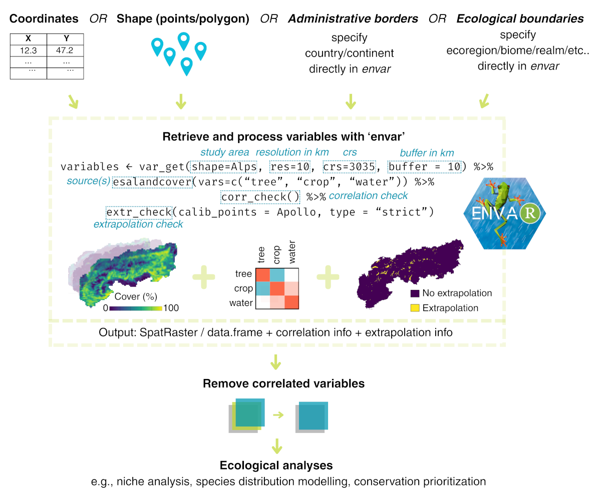

# envar

## Download environmental variables in R

The *envar R* package streamlines the retrieval and processing of
environmental variables for ecological modelling. Preparing variables
for macroecology and biogeography is time-consuming and requires the
standardization of different sources to the same study area and/or the
extraction of value across study points and/or the conversion to a
common coordinate reference system. *envar* is an *R* package that
allows the download of a wide range of environmental variables from
different pre-existing sources, to make the whole process of retrieving
variables easier and faster, and well integrated within the R
environment.

## Purpose and use

This graphic illustration depicts an ecological modelling framework and
the use of the *envar* package to retrieve variables while checking for
correlation and extrapolation. See below how to install the package and
for more detailed explanation check **[Get
started](https://animalbiodiversitylab.github.io/envar/articles/intro)**.



## Installation

#### Developmental version

The latest development version can be installed directly from the GitHub
repository to allow access to an always up-to-date package version
incorporating all the most recent fixes.

- To install the latest development version from
  [GitHub](https://github.com/animalbiodiversitylab/envar), use the
  following *R* code.

``` r

# install using the "remotes" package
if (!require(remotes)) install.packages("remotes")

remotes::install_github("animalbiodiversitylab/envar", 
                        dependencies = TRUE,
                        build_vignettes = FALSE)

# or alternatively using the "devtools" package
if (!require(devtools)) install.packages("devtools")

devtools::install_github("animalbiodiversitylab/envar", 
                         dependencies = TRUE,
                         build_vignettes = FALSE)
```

Once installed, load the package to run the examples and vignettes:

``` r

library(envar)
```

## Vignettes

We present the following vignettes to illustrate the use of the *envar
R* package:

- **[1. Installation of the library and first use
  example](https://animalbiodiversitylab.github.io/envar/articles/intro)**  
- **[2. Overview of potential uses of the
  package](https://animalbiodiversitylab.github.io/envar/articles/package_overview)**
- **[3. Presentation of available sources and variables with example
  code](https://animalbiodiversitylab.github.io/envar/articles/variables)**
- **[4. Example of use for species distribution
  modelling](https://animalbiodiversitylab.github.io/envar/articles/sdm)**

## Functions

An overview of all functions and data is given
**[here](https://animalbiodiversitylab.github.io/envar/reference/)**.

## Did you find a bug?

We are glad that you found a 🐛 and you can report it on the GitHub
Issues tab. Otherwise, you can send us an e-mail and we’ll do our best
to rapidly fix the issue.

## Dependencies

`envar` depends on `terra`, `dplyr`, `httr`, `sf`, `rnaturalearth`,
`usdm`, `corrplot`, `cli`, `fs`, `digest`, `rangeBuilder`, and `utils`.
The `rnaturalearthdata` package is also used (when selecting a study
area by country or continent) and is installed automatically with
`rnaturalearth`.

## Citation

Please cite the *envar R* package when using it in publications, and the
citation(s) associated with each source retrieved. The citations
specific to each source are printed in the console during the download
process. To cite the package, please use:

> Simoncini A, Bertoncini M, Cerofolini A, Dalpasso A, Falaschi M, Lo
> Parrino E (2026) envar: an R package to retrieve and process
> environmental variables for macroecology and biogeography. Under
> review at Ecological Informatics.
> <https://doi.org/10.22541/au.176918612.23247936/v1>

## Usage

Here we provide a short example showing how the *envar R* package can be
used to retrieve and process environmental variables for a specific use
case. To begin with, we will load the required packages.

``` r

# load packages
require(envar)
require(terra)
require(sf)

# download variables (e.g., the percentage cover of trees, ice and the slope) over a 
# study area (in this case, the "Alps" shapefile already included in 
# the package)
processed_vars = par_set(shape = Alps, res = 1, crs = 3035) %>% 
  melc(vars = c("trees", "ice")) %>% 
  topography(vars = c("slope"))
```

We will get a set of variables already cropped to the desired area of
study, and presented as a SpatRaster file with multiple layers
corresponding to the different variables:

``` r

# visualize the result
print(processed_vars)
#> class       : SpatRaster 
#> dimensions  : 689, 1073, 3  (nrow, ncol, nlyr)
#> resolution  : 994.8978, 994.8978  (x, y)
#> extent      : 3845222, 4912747, 2192710, 2878194  (xmin, xmax, ymin, ymax)
#> coord. ref. : ETRS89-extended / LAEA Europe (EPSG:3035) 
#> source(s)   : memory
#> names       :    trees,      ice,    slope 
#> min values  :  0.00000,  0.00000,  0.00000 
#> max values  : 99.99088, 99.62656, 37.86851
```

For a more in-depth explanation and examples refer to the **[Get
started](https://animalbiodiversitylab.github.io/envar/articles/intro)**
page.
