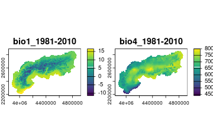
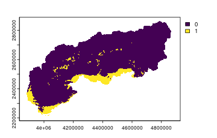

## Package aims

When conducting an ecological analysis, the response of one or more variable(s) is modeled as a function of one or more predictor(s). When variables are not directly collected in the field or through remote sensing, and information on the spatial location of samples is available, global and already published maps can be used to define variable values. This process is often time-consuming and requires the standardization of different sources to the same study area and/or the extraction of value across study points and/or the conversion to a common coordinate reference system. _envar_ is an _R_ package that allows the download of a wide range of environmental variables from different pre-existing sources, to make the whole process of retrieving variables easier and faster, and integrated within the R environment. The user can thus avoid to manually download and process different variables from different sources, and instead focus on the analysis itself and integrate the downloaded and processed variables within a single R pipeline. 

## First use: installation

First, we install the package with the following code.


``` r
# install using the "remotes" package
if (!require(remotes)) install.packages("remotes")
remotes::install_github("animalbiodiversitylab/envar", 
                        upgrade="never", 
                        dependencies=TRUE,
                        build_vignettes=FALSE)

# or alternatively using the "devtools" package
if (!require(devtools)) install.packages("devtools")
devtools::install_github("animalbiodiversitylab/envar", 
                        upgrade="never", 
                        dependencies=TRUE,
                        build_vignettes=FALSE)
```

## Load the library

When executing this command, another package (`dplyr`) will be automatically loaded to ensure the full functionality of the package. However, other packages are often required for plotting and further analyses and we also load them here for later use.


``` r
require(envar)
require(terra)
require(sf)
```

## Full working example

Here, we show a full working example of how to use the package to download and process a set of environmental variables for a specific study area. We will download a set of climatic, topographic, and land cover variables for a study area in the European Alps (already included in the package as the object `Alps()`). A call to the `par_set()` function is used to define the study area (argument "shape"), the desired grid output resolution in km (argument "res"), the coordinate reference system (argument "crs"), and an eventual buffer (in km) by which to expand the study area (argument "buffer"). The default resolution is always 30 arcseconds (0.008333333°, or ~ 1 km) at the equator, except for the `biooracle()` function, and "res" specifies a factor by which to aggregate (the default is 1 and doesn't apply any change). 

Then, the "%>%" is used to concatenate different commands. The next step is to set the specific functions that are used to download and process variables from different sources (see the **[reference](https://animalbiodiversitylab.github.io/envar/reference/)** for a full list). The call to a generic source is structured as: sourcename(vars = c()), where sourcename is the name of the function devoted to one source and inside the "vars" argument the specific variables to be downloaded from that source are specified. In this example, we first download a set of 5 bioclimatic variables from the CHELSA source [@karger2017], then we download elevation and slope from the topography source [@amatulli2018], and finally we download the percentage cover of trees and ice from the 1 km resolution global land cover based on the ESA 30 m land cover [@loparrino2025].

A correlation analysis can be performed with the to `corr_check()` function to identify and remove highly correlated variables. This function must always be called as the last one in the pipeline.

It is also possible to call the `extr_check()` function at the bottom of the code to enable an automatic test of extrapolation, regardless of whether you requested already a `corr_check()`. Ecological models often produce spurious predictions when predicting in environmental conditions not present in the calibration range [@elith2010]. This problem can arise under two conditions: 1) at least a variable has values outside the calibration range - strict extrapolation -, or 2) all variables fall in the calibration range, but novel combinations of predictor values are met - combinatorial extrapolation - [@zurell2012]. Inside the function it is possible to specify if strict and/or combinatorial extrapolation has to be checked (argument “type” - default to strict only), and it is necessary to specify the calibration points as data.frame with X and Y columns (argument “calib_points”) and the CRS of those coordinates (argument “calib_crs”) if different from the default (EPSG:4326). Extrapolation is checked creating an environmental overlap mask, using a method adapted from Zurell et al. (2012) [@zurell2012] and implemented natively within `envar`. To check extrapolation we assume that a dataset of 2648 occurrences of the _Parnassius apollo_ butterfly (dataset `Apollo()` already included in the package) was used to train any model and that we want to apply the model to the European Alps later on.

``` r
processed <- par_set(shape = Alps, crs = 3035, res = 2, buffer = 10) %>% 
             chelsa(vars = c("bio1", "bio4", "bio10", "bio12", "bio19"),
                    years = "1981-2010") %>%
             topography(vars = c("elevation", "slope")) %>%
             melc(vars = c("trees", "ice")) %>%
             corr_check() %>% 
             extr_check(calib_points = Apollo, type = "strict")
```

## Output overview

If the correlation and/or extrapolation analysis/es is/are performed, the output is a list. Otherwise, it is a SpatRaster (object to be used within the _terra R_ package), either with a single layer or with multiple layers if multiple variables were specified. If the output is a list, it contains the following elements: "data" (the SpatRaster or data.frame with your data), "correlation_matrix" containing a matrix of Pairwise Pearson's correlation coefficients between all variables, "vif" a data.frame containing the Variance Inflation Factors for each variable, a "summary" that reports if and which variables have a Pearson's correlation coefficient higher than |0.6| and/or a VIF higher than 3. The "plot_path" specifies the local directory to which a plot of the Pearson's pairwise correlation was saved. An "extrapolation" object will then be one layer - two if both strict and extrapolation are checked - reporting as 1 cells of extrapolation and 0 cells of no extrapolation. 


``` r
# Plot the first two variables
terra::plot(processed$data[[1:2]])
```

<div class="figure" style="text-align: center">

<p class="caption">plot of chunk unnamed-chunk-6</p>
</div>


``` r
# View the Pearson's pairwise correlation matrix
print(processed$correlation_matrix)
```

```
##                 bio1_1981-2010 bio4_1981-2010 bio10_1981-2010 bio12_1981-2010
## bio1_1981-2010       1.0000000    -0.17098433      0.99411075     -0.58856258
## bio4_1981-2010      -0.1709843     1.00000000     -0.06629979     -0.13822734
## bio10_1981-2010      0.9941107    -0.06629979      1.00000000     -0.61255277
## bio12_1981-2010     -0.5885626    -0.13822734     -0.61255277      1.00000000
## bio19_1981-2010     -0.4182732    -0.33185424     -0.45693075      0.84502782
## elevation           -0.9682340     0.06664318     -0.96993166      0.58178549
## slope               -0.7884759     0.01527641     -0.79705030      0.57544349
## trees                0.1420440    -0.28430061      0.10591260      0.02372563
## ice                 -0.4765922     0.13185174     -0.46273645      0.27137511
##                 bio19_1981-2010   elevation       slope        trees        ice
## bio1_1981-2010     -0.418273159 -0.96823403 -0.78847587  0.142043991 -0.4765922
## bio4_1981-2010     -0.331854239  0.06664318  0.01527641 -0.284300607  0.1318517
## bio10_1981-2010    -0.456930752 -0.96993166 -0.79705030  0.105912597 -0.4627365
## bio12_1981-2010     0.845027822  0.58178549  0.57544349  0.023725631  0.2713751
## bio19_1981-2010     1.000000000  0.44083530  0.39996749 -0.003624083  0.2299007
## elevation           0.440835298  1.00000000  0.83277881 -0.120815882  0.4857175
## slope               0.399967493  0.83277881  1.00000000  0.223848319  0.2433729
## trees              -0.003624083 -0.12081588  0.22384832  1.000000000 -0.3266344
## ice                 0.229900683  0.48571755  0.24337291 -0.326634442  1.0000000
```


``` r
# View the Variance Inflation Factor values
print(processed$vif)
```

```
##         Variables         VIF
## 1  bio1_1981-2010 3073.957200
## 3 bio10_1981-2010 2670.551839
## 6       elevation   40.083967
## 2  bio4_1981-2010   35.854595
## 7           slope    5.865724
## 4 bio12_1981-2010    5.292550
## 5 bio19_1981-2010    4.770264
## 8           trees    1.875957
## 9             ice    1.566896
```

To better understand the structure of correlation, we can also analyze the correlation plot that was locally stored. 

<div class="figure" style="text-align: center">

<p class="caption">plot of chunk unnamed-chunk-9</p>
</div>

This plot was created with the aid of the _corrplot R_ package and it helps to pinpoint correlation problems. In this example, we can see that elevation is highly correlated with multiple variables and as this is not a proximal variable (i.e., the effect of elevation on species distributions is mediated by other co-varying factors such as climate) we can remove it. To obtain a set of uncorrelated variables we might thus want to sub-set our variables as follows.


``` r
# define a set of uncorrelated variables
uncorrelated_vars <- processed$data[[c("bio1_1981-2010", "bio12_1981-2010", "trees", "ice")]]
```

We can also see where extrapolation occurs in our study area. This map can be used alongside any ecological prediction (e.g., species distribution models applied over the European Alps), to interpret more carefully predictions in areas where extrapolation is found.


``` r
# visualize the raster map of where extrapolation occurs (1 = extrapolation, 0 = no extrapolation)
terra::plot(processed$extrapolation$strict)
```

<div class="figure" style="text-align: center">

<p class="caption">plot of chunk unnamed-chunk-11</p>
</div>

## Conclusion

We have shown a single full example of use of the _envar R_ package. Instead of specifying a shape, we could have chosen a country/continent or defined a data.frame of points. For an overview of all the possible use-cases see the **[package overview vignette](https://animalbiodiversitylab.github.io/envar/articles/package_overview)** and for a full list of all the available sources and variables see the **[reference](https://animalbiodiversitylab.github.io/envar/reference/)**.

## Annex: a runnable mini-example

Downloading global environmental layers needs network access, so the download
chunks in this article are **shown but not executed** when the article is built through GitHub pages. To keep
the package fully reproducible and automatically tested, here you can also find a test that does not include any download: a WorldClim [@fick2017] extract for Switzerland with mean annual temperature (`bio1`), annual precipitation (`bio12`), `elevation` and `slope` at ~9 km resolution. The chunk below loads it **in place of a
download** and runs the heart of the workflow — the collinearity and
extrapolation checks — end to end. It is a miniature of what shown above.

```{r mini-example, message=FALSE, fig.height=3, fig.width=6.5}
library(envar)

# In a real analysis these layers would come from a download pipeline such as
#   par_set(country = "Switzerland") %>%
#     worldclim(vars = c("bio1", "bio12")) %>% topography(vars = "elevation")
# Here we simply load the equivalent layers bundled with the package:
example_file <- system.file("extdata", "switzerland.tif", package = "envar")
switzerland  <- terra::rast(example_file)
switzerland

# Check collinearity among the layers (bio1 and elevation are strongly related):
checked <- corr_check(switzerland)
checked$summary

# Flag environmental extrapolation relative to the Apollo butterfly
# occurrences that fall within Switzerland (used here as calibration points):
calib   <- subset(Apollo, X >= 5.9 & X <= 10.5 & Y >= 45.8 & Y <= 47.8)
checked <- extr_check(checked, calib_points = calib, type = "strict")

# Map mean annual temperature next to where extrapolation occurs
# (1 = novel conditions, 0 = analog conditions):
terra::plot(c(switzerland[["bio1"]], checked$extrapolation),
            main = c("bio1 (mean annual temp.)", "strict extrapolation"))
```

## References

