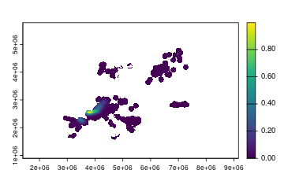
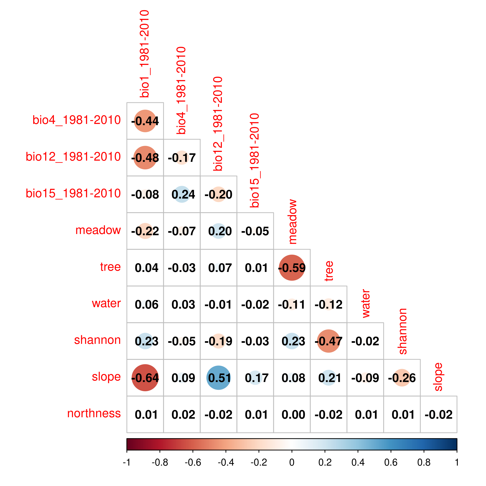
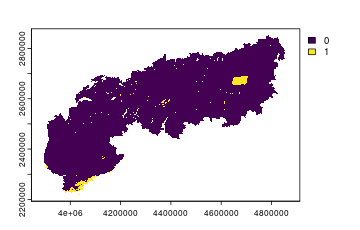
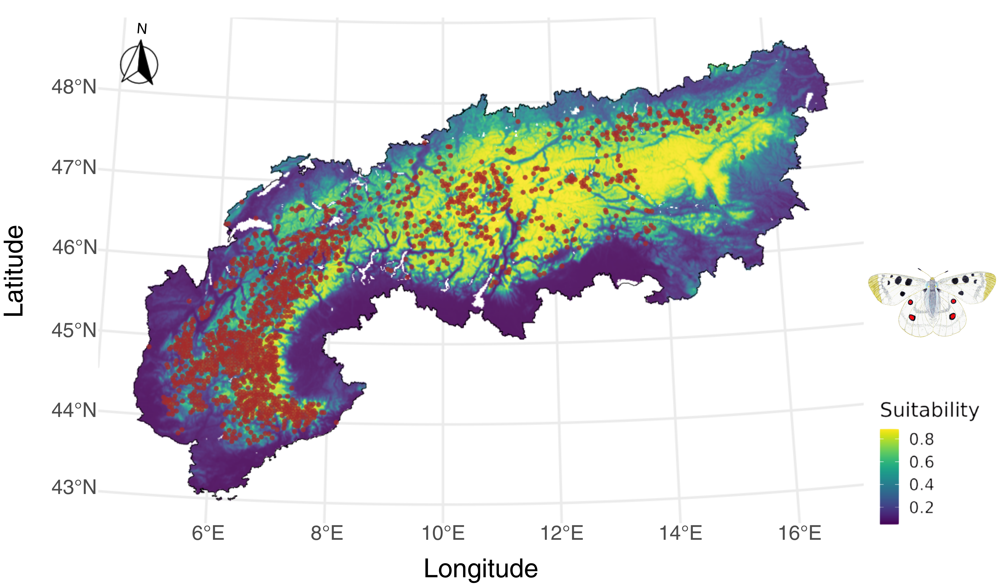

## Introduction

In this tutorial we show how _envar_ can be used to streamline a species distribution modelling framework, using as example the butterfly _Parnassius apollo_ over the European Alps. 

## Occurrence points

We use a set of 2648 records of the species in continental Europe obtained with a search on the **[Global Biodiversity Information Facility](https://www.gbif.org)**, filtering records with a positional uncertainty lower than 1 km. Additionally, we keep only one record among those in the same or adjacent cells, using the _GeoThinneR_ package [@mestretomas2025], to reduce the negative influence of spatial autocorrelation [@boria2014]. The resulting dataset is included in the package assets (`Alps()`) and can be accessed after loading the package in the R session. 


``` r
# load required R package
require(envar) # loads envar and dplyr packages

# the specific R versions used to run this tutorial can be installed with the code
# hashed (e.g. remotes:: ...)

# remotes::install_version("terra", version = "1.7-83")
require(terra)

# remotes::install_version("raster", version = "3.6-26")
require(raster)

# remotes::install_version("sf", version = "1.0-19")
require(sf)

# remotes::install_version("dismo", version = "1.3-14")
require(dismo)

# remotes::install_version("spatialEco", version = "2.0-4")
require(spatialEco)

# remotes::install_version("ENMeval", version = "2.0.5.2")
require(ENMeval)

# remotes::install_version("PresenceAbsence", version = "1.1.11")
require(PresenceAbsence)

# load occurrence data 
data(Apollo)
```


``` r
head(Apollo)
```

```
##          X        Y
## 1 13.49513 47.10400
## 2 12.62265 47.03912
## 3  6.65878 44.16551
## 4  5.40699 44.15510
## 5  6.05580 44.58935
## 6  6.86447 44.42881
```

## Background points

First, through _envar_ we define a template raster at ~ 1 km resolution and covering a buffer of 10 km around all occurrence points. This buffer covers areas that reasonably fall within the geographical range of the species, as defined by studies that developed distribution models for butterflies across the globe [@gross2025]. This layer can thus be used as a template for the creation of a kernel density representing the intensity of sampling effort, via the _spatialEco_ package [@evans2021]. Random background points (10,000) are defined in the same area, with a probability proportional to the sampling effort defined in the previous step, using the _dismo_ package [@hijmans2017]. 


``` r
# create a layer of sampling effort, as we need a template raster
occ_sf <- st_as_sf(Apollo, coords = c("X", "Y"), crs=4326)
occ_sf <- st_transform(occ_sf, 3035)

# use 'envar' to create a template raster with a 100 km buffer
template <- par_set(shape = occ_sf, buffer = 100, crs = 3035) %>% 
            melc(vars = "ice")

# create sampling bias raster
dens_ras <- spatialEco::sp.kde(x = occ_sf, 
                               ref = template, 
                               standardize = TRUE, 
                               mask = TRUE, 
                               res = res(template))

# pick background points proportionally to the sampling effort
bg_points <- as.data.frame(dismo::randomPoints(raster::raster(dens_ras), 10000, prob = TRUE))

colnames(bg_points) <- c('X', 'Y')
```


``` r
plot(dens_ras)
```

<div class="figure" style="text-align: center">

<p class="caption">plot of chunk unnamed-chunk-6</p>
</div>


``` r
head(bg_points)
```

```
##         X       Y
## 1 3271304 2262151
## 2 4102582 2583059
## 3 3317537 2145210
## 4 4203206 2923910
## 5 3565016 2181471
## 6 3455327 2211386
```

## Predictors

Then, we extract predictor values over presence and background points, for a set of variables that might have an ecologically-plausible effect on the species [@nakonieczny2007], using the _envar_ package and including the automatic check for correlation among variables. We included four climatic dimensions (annual mean temperature, temperature seasonality, annual total precipitation, precipitation seasonality) for the 1981-2010 period from CHELSA [@karger2017]; three land cover variables (percentage cover of meadows, trees, and water) and a measure of landscape diversity (Shannon’s index) from [@loparrino2025]; two topographical variables (slope, northness) from [@amatulli2018]. 


``` r
# divide data in spatial blocks for model calibration
occ_points <- cbind(st_drop_geometry(occ_sf), st_coordinates(occ_sf))
block <- ENMeval::get.block(occ_points, bg_points, orientation = "lat_lon")

# use 'envar' to extract predictor values at calibration points and check correlations 
occ_points$pa <- rep(1, nrow(occ_points));bg_points$pa <- rep(0, nrow(bg_points));data<-rbind(occ_points,bg_points)

# extract predictor values and check for correlation with 'envar'
predictors <- par_set(pointsdf = data[,c("X", "Y")], crs=3035) %>% 
              chelsa(vars = c("bio1", "bio4", "bio12", "bio15"), years =         "1981-2010") %>% 
              melc(vars = c("meadow", "tree", "water", "shannon")) %>% 
              topography(vars = c("slope", "northness")) %>% 
              corr_check()
```

We can then check the Variance Inflation Factor (VIF):


``` r
# View the Variance Inflation Factor values
print(predictors$vif)
```

```
##          Variables      VIF
## 1   bio1_1981-2010 2.853435
## 9            slope 2.290477
## 6             tree 1.951400
## 5           meadow 1.924321
## 3  bio12_1981-2010 1.900150
## 2   bio4_1981-2010 1.734129
## 4  bio15_1981-2010 1.200430
## 8          shannon 1.075895
## 7            water 1.030055
## 10       northness 1.002298
```

And the Pearson pairwise correlation coefficients:

<div class="figure" style="text-align: center">

<p class="caption">plot of chunk unnamed-chunk-10</p>
</div>

Slope and annual mean temperature (bio1) are negatively correlated with Pearson’s correlations ≥ |0.6|. No variables have a VIF higher than 3. Thus, we remove one of these variables; the one with a lower direct impact on the species physiology and distribution (slope).


``` r
# remove slope to avoid correlation issues
predictors$data <- predictors$data[, !names(predictors$data) %in% c("slope")]

data <- cbind(predictors$data, data$pa); colnames(data)[colnames(data)=="data$pa"] <- "pa"
```

## Model tuning

Then, we fine-tune the hyperparameters of Maxent models [@phillips2006], using the _ENMeval R_ package and a four-fold spatial block cross-validation [@muscarella2014]. We use Maxent as it is the most widely used algorithm for SDMs and its hyperparameters can be easily fine-tuned [@radosavljevic2014]. In particular, we tune the regularization multiplier (a parameter that controls overfitting), and the combination of features (i.e., transformations of predictors). We select the combination of hyperparameters that minimizes the difference between the AUC (Area Under the receiver-operating characteristic Curve, a threshold-independent metric of predictive performance [@fielding1997]) in the test and training calibration sets. A higher value would imply a greater overfitting, as predictive ability would be higher on the train compared to the test set [@radosavljevic2014]. 


``` r
# Tune maxent models
sdms <- ENMeval::ENMevaluate(
  occs = data[data$pa == "1", c(2:(ncol(data)-1))],
  bg = data[data$pa == "0", c(2:(ncol(data)-1))],
  tune.args = list(rm = 1:8, fc = c("L", "LQ", "LQH")),
  partitions = "user",
  user.grp = block,
  algorithm = "maxent.jar")

# row number of the best model (best test Boyce index)
index <- which.max(sdms@results$cbi.val.avg)
sdm_best <- sdms@models[[index]]
```


``` r
# show tuning table
ordered <- sdms@results[order(sdms@results$cbi.val.avg), ]

# best model metrics
print(ordered[1, c("rm", "fc", "cbi.val.avg", "cbi.val.sd", "auc.val.avg", "auc.val.sd", "auc.diff.avg", "auc.diff.sd")])
```

```
##    rm  fc cbi.val.avg cbi.val.sd auc.val.avg auc.val.sd auc.diff.avg
## 17  1 LQH      0.8055  0.3836687   0.8962352 0.06966646   0.05119765
##    auc.diff.sd
## 17  0.05698383
```

## Prediction in the Alps

The tuned model has a good predictive performance and a limited overfitting. This model can thus be applied to obtain a map of current habitat suitability for _Parnassius apollo_ over the European Alps, after retrieving predictors for this area using the _envar R_ package again.


``` r
# use 'envar' to define predictors over the prediction area (European Alps)
predictorsAlps <- par_set(shape = Alps, crs = 3035) %>% 
                  chelsa(vars = c("bio1", "bio4", "bio12", "bio15"), years = "1981-2010") %>% 
                  melc(vars = c("tree", "meadow", "water", "shannon")) %>% 
                  topography(vars = c("northness")) %>% 
                  extr_check(calib_points = data[,c("X", "Y")], calib_crs = 3035, type = "strict") 

# predict with the best model over the European Alps
predictionAlps <- dismo::predict(sdm_best, predictorsAlps$data)
```

As we added the optional function "extr_check", we checked if the environmental conditions found in the prediction area are consistent with those that were provided to the models in the training phase. Here we only checked for "strict" extrapolation only (i.e. at least one predictor outside the range found during calibration) [@zurell2012]. 


``` r
extr = predictorsAlps$extrapolation$strict
plot(extr)
```

<div class="figure" style="text-align: center">

<p class="caption">plot of chunk unnamed-chunk-15</p>
</div>

We can then plot the prediction of habitat suitability for _Parnassius apollo_ over the European Alps:

<div class="figure" style="text-align: center">

<p class="caption">plot of chunk unnamed-chunk-16</p>
</div>

## Conclusion

By using _envar_ to retrieve data over a greater spatial area than the final prediction one, we were able to reduce the influence of niche truncation on the final output [@guisan2025]. Additionally, we could  discriminate the drivers of species distribution instead of the drivers of sampling bias, by picking bias-corrected background points in a template defined with _envar_.

## References
